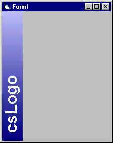



## csLogo

### Description

A control to create a sidebarlogo. It is based on code i found at http://www.vbaccelerator.com. I was tired to remember the settings of the picturebox so I created this little Custom Control.
 
### More Info
 

             |
---                |---
**Submitted On**   |2000-11-30 23:31:52
**By**             |[Claudius Schultz](https://github.com/Planet-Source-Code/PSCIndex/blob/master/ByAuthor/claudius-schultz.md)
**Level**          |Intermediate
**User Rating**    |4.3 (17 globes from 4 users)
**Compatibility**  |VB 6\.0
**Category**       |[Custom Controls/ Forms/  Menus](https://github.com/Planet-Source-Code/PSCIndex/blob/master/ByCategory/custom-controls-forms-menus__1-4.md)
**World**          |[Visual Basic](https://github.com/Planet-Source-Code/PSCIndex/blob/master/ByWorld/visual-basic.md)
**Archive File**   |[CODE\_UPLOAD1221211302000\.zip](https://github.com/Planet-Source-Code/claudius-schultz-cslogo__1-13228/archive/master.zip)

